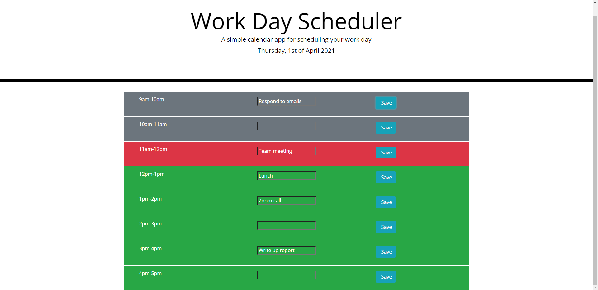

Workday Planner

[Link](https://jessluff.github.io/day-planner/)

This webpage uses HTML, CSS, Javascript and local storage.

This webpage allows a user to fill in a day planner with events for each hour block of time.
When the user clicks the save button after entering an event, the details are saved locally.
Therefore even if the page is refreshed, the information is maintained.
The current time block will be red, past time blocks grey and future time blocks green.

Creator: JessLuff
Email: jessica.luff@outlook.com
[Github](https://github.com/JessLuff)
